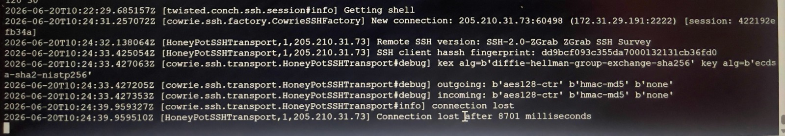

# Cloud Honeypot Project 🍯

## Overview
This project demonstrates a cloud-based SSH honeypot using Cowrie deployed on AWS EC2.

## Architecture
- **Cloud Provider**: AWS EC2 (t3.micro, Ubuntu 24.04)
- **Honeypot**: Cowrie (Medium-interaction SSH honeypot)
- **Monitoring**: Real-time log monitoring

## What I Learned
- AWS EC2 provisioning and security groups
- SSH key management
- Linux system administration
- Honeypot deployment and configuration
- Threat intelligence gathering

## Results
- Successfully caught real attackers scanning the honeypot
- Logged attacker IP addresses and attempted credentials
- Gained hands-on experience with cloud security

## Sample Log
Here is a screenshot of a real hacker trying to break into my honeypot:

## How to Deploy
1. Launch an AWS EC2 instance (Ubuntu 24.04, t3.micro)
2. Clone Cowrie: `git clone https://github.com/cowrie/cowrie`
3. Install dependencies and run Cowrie
4. Monitor logs for attack attempts

---

## Project 2: Serverless Phishing Simulation ☁️

### Overview
A serverless phishing simulation built on AWS using S3, Lambda, and CloudWatch.

### Architecture
- **Frontend**: S3 Static Website
- **Backend**: AWS Lambda (Python)
- **API**: Lambda Function URL
- **Monitoring**: CloudWatch Logs

### Skills Demonstrated
- AWS Serverless Architecture
- S3 Static Hosting
- Lambda Functions
- CloudWatch Logging
- Python Development

### Test Result
✅ Lambda function executed successfully with `Execution successful: Succeeded`

### CloudWatch Logging
✅ All login attempts were successfully logged to CloudWatch with timestamps, email addresses, and source IPs.

**Sample Log Entry:**
```json
{
    "timestamp": "2026-06-21T13:14:01.566732",
    "email": "test@example.com",
    "password_hash": "ecd71870d1963316a97e3ac3408c9835ad8cf0f3c1bc703527c30265534f75ae",
    "source_ip": "102.88.112.221"
}
